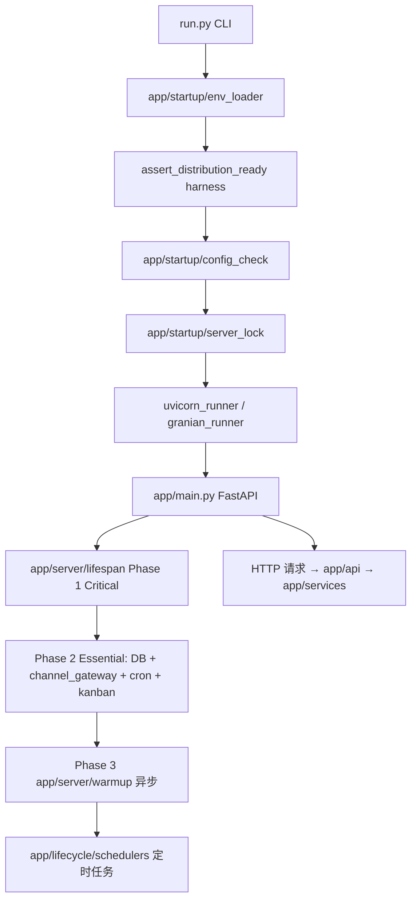

# MyrmAgent 开源产品仓架构

> **许可**: MIT · **仓库**: `myrm-agent`（server + frontend + desktop + 根 `scripts/`）  
> **产品定位**: 通用 AI 工作伙伴（GUI），对标 OpenClaw / Cowork / Hermes；**非**专业编码 IDE。  
> **Agent 交互**: 对话与配置均在 WebUI；`myrm` 仅为安装/启动引导（`setup|start|searxng`），不是 Agent CLI 产品。

---

## 五仓与依赖边界

| 仓库 | 路径（monorepo） | 许可 | 职责 |
|------|------------------|------|------|
| **myrm-agent** | `myrm-agent/` | MIT 开源 | 单机业务 server、Web UI、Tauri 桌面 |
| **myrm-agent-harness** | `myrm-agent-harness/` | 闭源 | Agent 执行引擎（类 LangChain）；PyPI 分发 |
| **myrm-control-plane** | `myrm-control-plane/` | 闭源 | SaaS/企业：调度**每用户独立沙箱 + Volume**（非传统多租户 DB） |
| **myrm-agent-brand** | `myrm-agent-brand/` | 闭源 | 官网 `myrm-website/`、文档 `myrm-docs/` |

**禁止引用已删除路径**: `open-perplexity/myrm-website`、`myrm-docs`、`myrm-agent-server`、`myrm-agent-frontend`、`myrm-agent-desktop`（根目录旧布局）。产品代码仅在 `myrm-agent/` 下。

**依赖铁律**

- OSS **永不** vendoring harness 源码；server 仅 `uv.lock` → PyPI `myrm-agent-harness`。
- server = **单租户**业务编排（`MYRM_DATA_DIR`），**无** `user_id` 多租户。
- CP **不 import** harness；沙箱内跑 server。
- harness **不感知** GUI / CP / 产品品牌。

沙箱执行模型详见闭源文档：  
`myrm-agent-harness/src/myrm_agent_harness/toolkits/code_execution/EXECUTION_SYSTEM.md`  
框架原则：`myrm-agent-harness/FRAMEWORK_DESIGN_PRINCIPLES.md`

---

## 三种部署模式（均为产品主力）

| 模式 | 用户如何接入 | server 运行位置 | 是否需要 CP |
|------|--------------|-----------------|-------------|
| **本地 WebUI** | `curl\|bash` / `irm\|iex` → `myrm start` 或 monorepo `myrm setup` + `myrm start` + `bun run dev` | 本机 :8080 | 否 |
| **Tauri 桌面** | GitHub Releases 安装包 | 内嵌 Python sidecar（默认 :8080） | 否 |
| **SaaS 云托管** | `app.myrmagent.ai` | CP 分配的**独立沙箱**内 server | 是（调度/Volume/ingress） |

- 本地/桌面：单机或用户自有沙箱，数据在本地 SQLite + Qdrant + 文件系统。
- SaaS：CP 注入 [S] 层环境变量（见 server `ARCHITECTURE.md` §0.06）；前端 `NEXT_PUBLIC_CP_BASE_URL` / `lib/cp-base-url.ts` 仅在该构建形态启用。

`components/billing/` 与 entitlements gate：**沙箱 Work Unit / 功能门禁 UI**，不是「多租户共享数据库」意义上的传统 SaaS。

---

## 本仓目录导航

```
myrm-agent/
├── ARCHITECTURE.md          ← 本文件（五仓 + 三模式 + 文档索引）
├── _ARCH.md                 ← 子目录职责表（分形 L3 入口）
├── shared/                  ← 前后端共享静态配置 → shared/_ARCH.md
├── myrm-agent-server/       ← FastAPI 业务层 → 详见 server/ARCHITECTURE.md
├── myrm-agent-frontend/   ← Next.js WebUI
├── myrm-agent-desktop/      ← Tauri + sidecar 打包 → desktop/_ARCH.md
└── scripts/                 ← OSS 安装与 myrm CLI → scripts/_ARCH.md
```

| 子目录 | 文档入口 |
|--------|----------|
| Server | [myrm-agent-server/ARCHITECTURE.md](myrm-agent-server/ARCHITECTURE.md) |
| Server `app/` | [myrm-agent-server/app/_ARCH.md](myrm-agent-server/app/_ARCH.md) |
| Frontend 组件 | [myrm-agent-frontend/src/components/_ARCH.md](myrm-agent-frontend/src/components/_ARCH.md) |
| Frontend 状态 | [myrm-agent-frontend/src/store/_ARCH.md](myrm-agent-frontend/src/store/_ARCH.md) · 聊天类型 [chat/types/_ARCH.md](myrm-agent-frontend/src/store/chat/types/_ARCH.md) · 流式 reducer [messageStream/_ARCH.md](myrm-agent-frontend/src/store/chat/messageStream/_ARCH.md) |
| Frontend API 客户端 | [myrm-agent-frontend/src/services/_ARCH.md](myrm-agent-frontend/src/services/_ARCH.md) |
| Frontend 工具审批 UI | [myrm-agent-frontend/src/lib/approval/_ARCH.md](myrm-agent-frontend/src/lib/approval/_ARCH.md) · inline BBox · AttentionBar · Tauri OS overlay |
| Desktop | [myrm-agent-desktop/_ARCH.md](myrm-agent-desktop/_ARCH.md) |
| Security Center（供应链仪表盘） | WebUI [`/security`](myrm-agent-frontend/src/app/security/page.tsx) · API `myrm-agent-server/app/api/security/router.py` · SaaS 告警 ingest 在闭源 CP |

**Git 与分发**：本文件即 OSS 产品仓的 Git/五仓/三模式定稿。Monorepo 维护者私有开发壳（Git remote `vortexai`）使用 `./myrm` 与子模块指针；见维护者速查 `scripts/dev/MAINTAINER_QUICKSTART.md`（路径相对于 vortexai 根，不在本 OSS 仓内）。

---

## 分形自文档（四层）

1. **根** — `ARCHITECTURE.md`（本文件） / `_ARCH.md`
2. **技术方案** — `*_SYSTEM.md`（如 `app/channels/CHANNELS_SYSTEM.md`）
3. **模块** — 每目录 `_ARCH.md`（模块说明；GitHub 入口 README 仅保留快速启动）
4. **文件** — `[INPUT]` / `[OUTPUT]` / `[POS]` 或 `@input` / `@output` / `@pos`

Server 门禁：`myrm-agent-server/scripts/check_fractal_docs.py`（`app/**` 目录 `_ARCH.md`；`--strict-headers` + `fractal_header_baseline.txt` 防回退）。Frontend：`next build` 校验 settings 模块图（见 `.github/workflows/frontend-build.yml`）。

---

## 进程启动序（Server）



| 阶段 | 模块 | POS |
|------|------|-----|
| 进程入口 | `run.py` → `app/startup/*` | OS 进程、锁、uvicorn |
| 运行时生命周期 | `app/server/lifespan.py` | FastAPI lifespan 三阶段 |
| 后台编排 | `app/lifecycle/*` | Gateway/Cron/看板/记忆守护者等 |
| 请求路径 | `app/api` → `app/services` → harness | 单机业务编排 |

### Channels 三层（新人导航）

| 层 | 路径 | 职责 |
|----|------|------|
| 框架 | `app/channels/` | 消息总线、Provider 实现、入站路由（见 `CHANNELS_SYSTEM.md`） |
| HTTP | `app/api/channels/` | 管理端点、Webhook 入站、连接测试 |
| 业务 | `app/services/channels/` + `app/core/channel_bridge/` | 配对、Agent 绑定、实例配置 |

---

## 快速启动（贡献者）

```bash
# 仓库内
bash scripts/install.sh   # 或 myrm setup
myrm start                # 后端 :8080
cd myrm-agent-frontend && bun install && bun run dev   # :3000
```

WebUI: http://localhost:3000 · API: http://localhost:8080

---

## 架构约束（开源仓）

- 不得将通用 Agent 框架能力下沉到 server；应进 harness。
- 不得在本仓实现 CP 级多租户调度或 harness import。
- 新增能力前先判定归属：harness（执行/工具/记忆内核） vs server（GUI/渠道/部署体验） vs CP（沙箱池/ingress 分配）。
