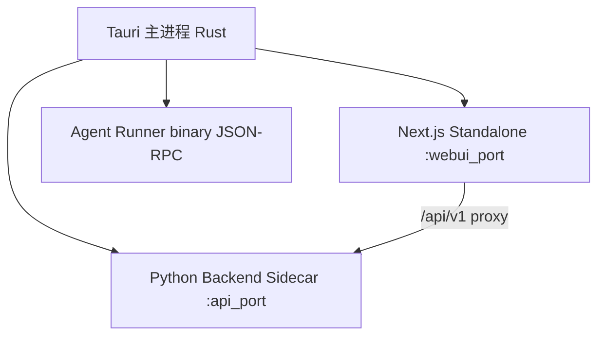

# myrm-agent-desktop 架构

> **许可**: MIT · **父仓**: [myrm-agent/ARCHITECTURE.md](../ARCHITECTURE.md)  
> **定位**: Tauri 桌面壳 — WebView + 系统 API + Python/Next.js/Agent Runner 三进程编排

## 概述

桌面客户端将 `myrm-agent-server`（FastAPI）与 `myrm-agent-frontend`（Next standalone）以 Sidecar 形态内嵌，Rust 主进程负责 IPC、托盘、全局快捷键、OTA 与进程生命周期。与 `myrm start` 本地 WebUI 共用同一后端应用，仅打包与启动路径不同。

## 三进程架构

Tauri 启动时 **始终** 拉起 Next.js Standalone（Release 经 `frontend-shell` 轮询 `webui_port` 后跳转）。`enable_webui_mode` 仅切换 Python 后端绑定端口（Desktop `8080` / WebUI `25808`）与远程接入，不控制 Next 是否自启。

| 模式 | Python 绑定 | Next | 说明 |
|------|-------------|------|------|
| Desktop 内嵌 | `127.0.0.1:8080` | `:webui_port` 始终自启 | WebView → frontend-shell → Next → API :8080 |
| WebUI Local | `127.0.0.1:25808` | `:webui_port` | 本机浏览器访问 |
| WebUI Remote | `0.0.0.0:25808` | `:webui_port` | 需 Setup Token |

## 目录导航

| 路径 | 职责 | 文档 |
|------|------|------|
| `src-tauri/` | Rust 主程序、Tauri 配置、图标 | [src-tauri/src/_ARCH.md](src-tauri/src/_ARCH.md) |
| `src-tauri/src/runtime/` | Sidecar 编排、Appshot、Watchdog | [src-tauri/src/runtime/_ARCH.md](src-tauri/src/runtime/_ARCH.md) |
| `src-tauri/src/commands/` | Tauri IPC 命令 | [src-tauri/src/commands/_ARCH.md](src-tauri/src/commands/_ARCH.md) |
| `src-tauri/src/sidecar/` | Agent Runner JSON-RPC 进程管理 | [src-tauri/src/sidecar/_ARCH.md](src-tauri/src/sidecar/_ARCH.md) |
| `src-tauri/src/sessions/` | CLI 会话存储 | [src-tauri/src/sessions/_ARCH.md](src-tauri/src/sessions/_ARCH.md) |
| `src-tauri/src/permissions/` | Explore/Ask/Auto 权限 | [src-tauri/src/permissions/_ARCH.md](src-tauri/src/permissions/_ARCH.md) |
| `src-tauri/src/utils/` | 平台工具（电源、锁屏、OTA 校验） | [src-tauri/src/utils/_ARCH.md](src-tauri/src/utils/_ARCH.md) |
| `src-tauri/frontend-shell/` | Release WebView 启动轮询页（`withGlobalTauri` + IPC `webui_port`；`frontend-start-failed` 阻断轮询，`backend-start-failed` 仅警告并继续跳转） | 见 [_ARCH.md](_ARCH.md) § frontend-shell |
| `sidecar/` | PyInstaller + Bun compile 构建入口 | [sidecar/_ARCH.md](sidecar/_ARCH.md) |
| `sidecar/agent-runner/` | Agent Runner TypeScript 源码 | [sidecar/agent-runner/_ARCH.md](sidecar/agent-runner/_ARCH.md) |
| `scripts/` | 构建、验签、分形门禁 | [scripts/_ARCH.md](scripts/_ARCH.md) |

## Sidecar 命名对照（避免歧义）

| 仓库路径 | 运行时角色 |
|----------|------------|
| `sidecar/build.py` | **构建** Python 后端 + Agent Runner 二进制 |
| `src-tauri/src/runtime/python_backend.rs` | **运行** Python FastAPI Sidecar |
| `src-tauri/src/sidecar/` | **运行** Agent Runner 进程（JSON-RPC stdio） |

详细对照表见 [_ARCH.md](_ARCH.md)。

## 技术方案文档

| 文档 | 内容 |
|------|------|
| [DESKTOP_RELEASE_SYSTEM.md](DESKTOP_RELEASE_SYSTEM.md) | 签名、公证、OTA、发版密钥与 CI 验签 |

## 质量门禁

- `scripts/check-fractal-docs.ts` — `_ARCH.md` 清单 + 核心 `[INPUT]` + Rust 行数预算
- CI: `.github/workflows/desktop-fractal-docs.yml`（分形文档 + launch contract smoke + `cargo check`）
- 发版: `scripts/ci/desktop-release/`（monorepo 根）；`build-macos-arm` 含 `smoke-launch-runtime.sh` 运行时烟测

## 架构约束

- 不 vendoring harness；Python Sidecar 经 PyInstaller 捆绑解释器与依赖
- `.tauri/` 私钥、`src-tauri/binaries/`、`src-tauri/gen/schemas/` 不入库
- 业务 API 契约由 `myrm-agent-server` 定义；desktop 仅编排与系统能力封装
