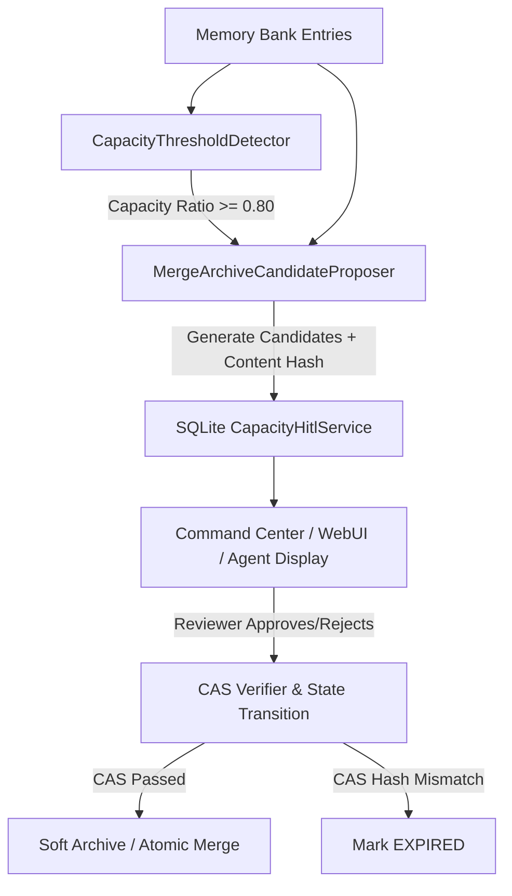

# Memory Near Capacity Merge/Archive Candidate HITL Architecture Contract

## 1. 模块定位与职责边界
本模块属于 `myrm-agent-harness` 框架层的核心记忆生命周期容量管理组件，对标 Mobie CC 0.4.0「记忆接近上限时提出合并/归档候选（只展示不自动改动）」。
- **职责**：
  1. 监控记忆库条目与配额利用率，提供多阶梯容量预警 (`CapacityThresholdDetector`，NORMAL / NEAR_CAPACITY / CRITICAL_FULL)；
  2. 当逼近阈值时，自动发掘合并（Merge）与归档（Archive）建议 (`MergeArchiveCandidateProposer`)；
  3. **铁律：只展示候选建议，绝对禁止在未经人类授权的情况下自动修改或物理删除记忆数据**；
  4. 提供本地轻量线程安全 SQLite 待审队列管理与软归档冷存储 (`CapacityHitlService`)；
  5. 引入 CAS（Compare-And-Swap）原条目内容哈希指纹校验，抵御并发审查修改冲突；
  6. 向 Agent 运行时暴露容量监测与候选查询只读元工具 (`CapacityHitlMetaTools`)。
- **边界禁区**：
  - 严禁包含多租户或云托管业务逻辑（此为框架层，面向单机/单沙箱）；
  - 严禁自动执行破坏性操作，所有合并与归档变更必须由上层 HITL 决策触发。

## 2. 核心架构交互流

## File & Submodule Index

| File | Role | Description | I/O/P |
|------|------|-------------|-------|
| `__init__.py` | Package | Package facade for capacity hitl. | ✅ |
| `detector.py` | Core | Detects memory capacity utilization levels against configured threshold ladders. | ✅ |
| `models.py` | Types | Types and models for capacity hitl. | ✅ |
| `proposer.py` | Core | Read-only candidate proposer formulating merge and archive recommendations without mutating data. | ✅ |
| `service.py` | Core | Thread-safe SQLite service for human-in-the-loop near-capacity candidate management. | ✅ |
| `tools.py` | Core | Agent meta tools for monitoring memory capacity and proposing HITL candidates. | ✅ |
