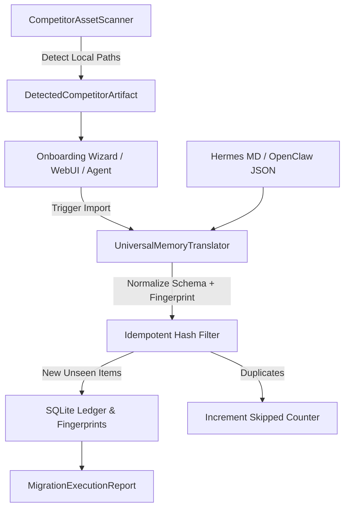

# Competitor Memory Seamless Migration & Translator Architecture Contract

## 1. 模块定位与职责边界
本模块属于 `myrm-agent-harness` 框架层的生态互联与数据可移植性扩展，对标 OpenClaw 2.0 原生一键扫描并吸纳 Hermes/竞品生态记忆的心智。
- **职责**：
  1. 提供跨生态资产本地安全探测器 (`CompetitorAssetScanner`)，识别本机已有的 Hermes/OpenClaw/ChatGPT 导出记忆；
  2. 提供异构 Schema 智能归一化转译引擎 (`UniversalMemoryTranslator`)，提取记忆单元并映射至五级认知图谱；
  3. 提供本地轻量线程安全 SQLite 迁移审计账本与幂等去重防撞索引 (`CompetitorMigrationService`)；
  4. 向 Agent 运行时暴露自主探测与一键导入转译元工具 (`CompetitorMigrationMetaTools`)。
- **边界禁区**：
  - 严禁包含多租户或云托管业务逻辑（此为框架层，面向单机/单沙箱）；
  - 严禁向外部任何网络发送用户数据，所有探测与转译均在本地沙箱闭环；
  - 严禁反向依赖竞品专有 SDK。

## 2. 核心架构交互流

