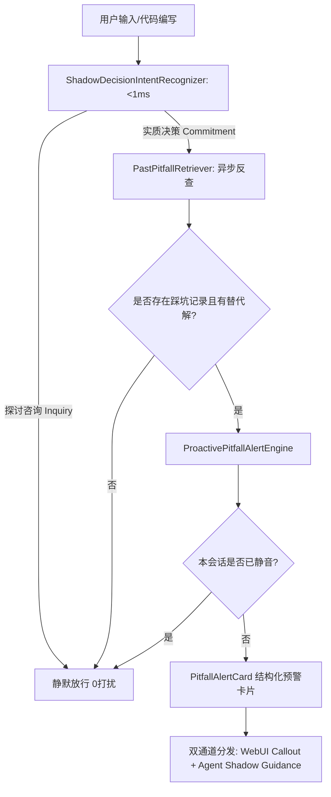

# Proactive Past-Pitfall Alert & Decision Assist Architecture Contract

## 1. 模块定位与职责边界
本模块属于 `myrm-agent-harness` 框架层的认知前瞻与主动协同扩展，对标个人 AI 操作系统“参与决定的个人外脑”愿景。
- **职责**：
  1. 提供亚毫秒级双模态影子决策意图嗅探器 (`ShadowDecisionIntentRecognizer`)，区分探讨咨询与实质选型；
  2. 提供因果三元组精准反查引擎 (`PastPitfallRetriever`)，提取“当时方案 ➔ 踩坑教训 ➔ 已验证替代方案”，过滤纯肯定性记忆，评估版本漂移；
  3. 提供非侵入式轻量 Callout 预警卡片与会话级智能静音引擎 (`ProactivePitfallAlertEngine`)；
  4. 支持双通道分发：高危弹前端 Callout，中低危作为 Agent 思考层影子约束注入。
- **边界禁区**：
  - 严禁包含多租户或云托管业务逻辑（面向单机单沙箱）；
  - 严禁阻塞主对话生成，嗅探耗时 < 1ms，反查完全异步；
  - 严禁反向依赖外部大模型进行意图嗅探，纯本地规则化极速闭环。

## 2. 核心架构时序流

## File & Submodule Index

| File | Role | Description | I/O/P |
|------|------|-------------|-------|
| `__init__.py` | Package | Package facade for proactive pitfall alert. | ✅ |
| `_ARCH.md` | Doc | Architecture contracts and component specifications. | ✅ |
| `models.py` | Types | Strongly-typed schemas: intents, triad records, alert cards. | ✅ |
| `intent_recognizer.py` | Core | Deterministic shadow decision intent sniffing engine. | ✅ |
| `retriever.py` | Core | Causal triad past pitfall retrieval with drift attenuation. | ✅ |
| `engine.py` | Core | Unified orchestration pipeline with session mute management. | ✅ |
