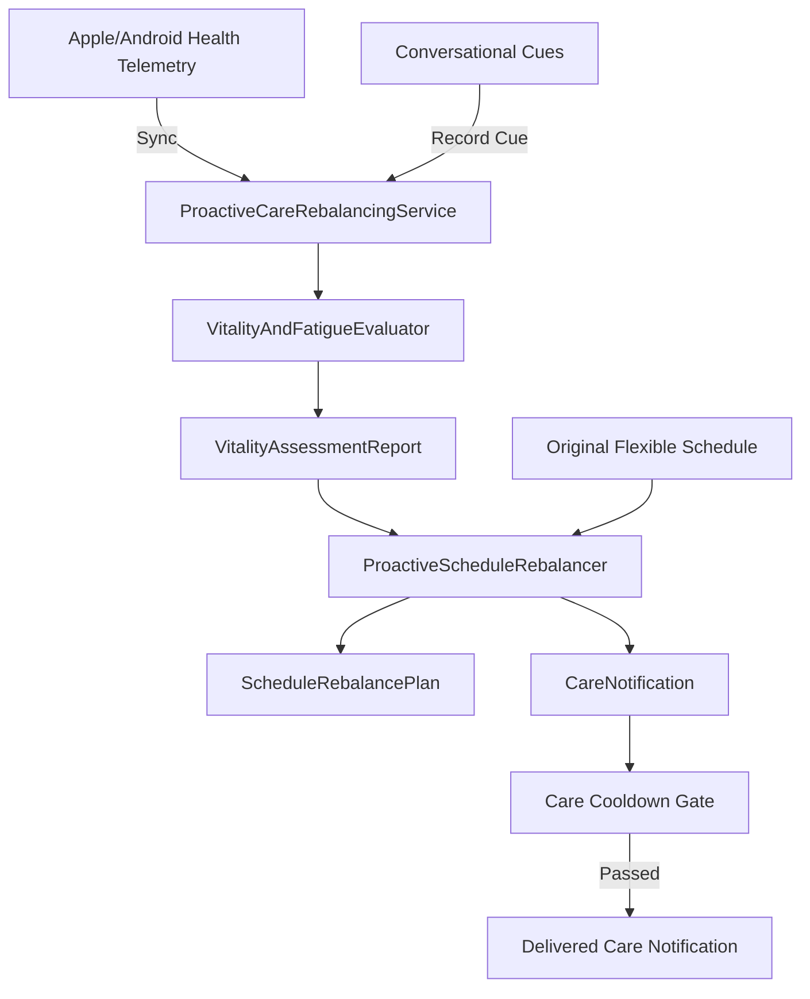

# Proactive Care & Schedule Rebalancing Architecture Contract

## 1. 模块定位与职责边界
本模块属于 `myrm-agent-harness` 框架层的核心记忆与主动关怀能力扩展，对标 Today 花卷「Acts Before You Ask」心智。
- **职责**：
  1. 提供消费级移动健康生理体征数据模型 (`HealthMetricsRecord`)；
  2. 跨模态结合硬件体征与对话疲劳口癖线索，评估用户真实能量与疲劳等级 (`VitalityAndFatigueEvaluator`)；
  3. 在无需用户主动要求的情况下，先于提问主动调轻或顺延非紧急弹性任务计划，并合成温暖体贴的主动关怀推送通知 (`ProactiveScheduleRebalancer`)；
  4. 提供本地轻量线程安全 SQLite 持久化与关怀冷却门禁 (`ProactiveCareRebalancingService`)；
  5. 向 Agent 运行时暴露自主状态评估与弹性排期元工具 (`ProactiveCareMetaTools`)。
- **边界禁区**：
  - 严禁包含多租户或云托管业务逻辑（此为框架层，面向单机/单沙箱）；
  - 严禁擅自删除或取消核心重要日程，仅针对弹性任务进行负荷弹性伸缩。

## 2. 核心架构交互流

