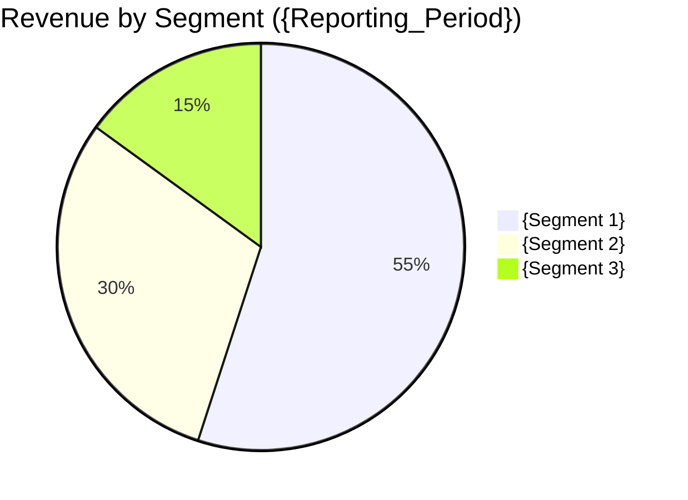

# Financial & Business Analysis Report Template (6-Dimensional Framework)

> Standard institutional format for comprehensive equity research, corporate due diligence, and management strategic reviews.

---

```markdown
# 📊 Financial & Business Analysis Report: [{ticker_or_code}] {company_name}

> **Reporting Period**: {period_e.g._FY2025_or_Q2_2026} · **Base Currency**: {currency_e.g._USD/RMB} · **Unit Scale**: {Millions/Billions}
> **Primary Filing Sources**: {SEC_10-K_URL_or_CnInfo_Announcement} · **Audit Status**: Audited / Unaudited

---

## 1. Executive Summary & Strategic Positioning (执行摘要与战略评级)
- **Financial Health Rating**: ⭐⭐⭐⭐☆ (4.2/5.0 - Strong / Moderate / Strained / Distressed)
- **Core Value Proposition & Business Model**: {Concise 2-sentence breakdown of how the company generates revenue and cash}.
- **Key Financial Highlights**:
  - **Revenue**: {Value} ({YoY_growth_rate}% YoY, {QoQ_growth_rate}% QoQ)
  - **Gross / Operating Margin**: {Gross_Margin}% / {Operating_Margin}% (Δ {YoY_delta_bps} bps YoY)
  - **Free Cash Flow (FCF)**: {FCF_Value} (FCF Conversion Rate: {FCF_to_NetIncome}%)
  - **Net Debt / Cash Position**: {Net_Cash_or_Debt_Value}
- **Strategic Takeaway**: {1 paragraph distillation of competitive durability and core growth catalysts}.

---

## 2. Revenue Dynamics & Segment Growth (营收结构与业务分部拆解)

### 2.1 Segment Breakdown
| Business Segment | Revenue ({Currency}M) | YoY Growth | % of Total Revenue | Gross Margin | Margin Trend |
| :--- | :--- | :--- | :--- | :--- | :--- |
| {Segment 1} | {Rev_1} | {+XX.X%} | {XX.X%} | {XX.X%} | Expanding / Stable / Contracting |
| {Segment 2} | {Rev_2} | {+XX.X%} | {XX.X%} | {XX.X%} | Expanding / Stable / Contracting |
| {Segment 3} | {Rev_3} | {+XX.X%} | {XX.X%} | {XX.X%} | Expanding / Stable / Contracting |
| **Total Consolidated** | **{Rev_Total}** | **{+XX.X%}** | **100.0%** | **{Consolidated_GM}%** | -- |

### 2.2 Growth Drivers & Market Dynamics
- **Organic vs Acquisition Driver**: {Analysis of volume vs price vs M&A expansion}.
- **Geographic Diversification**: {Domestic vs International distribution and currency exposure}.



---

## 3. Profitability Quality & DuPont Decomposition (盈利质量与杜邦三因子拆解)

### 3.1 DuPont Analysis Breakdown
$$ROE = \text{Net Profit Margin} \times \text{Asset Turnover} \times \text{Financial Leverage (Equity Multiplier)}$$

| Metric | Current Period | Prior Year Period | YoY Δ | Key Underlying Driver |
| :--- | :--- | :--- | :--- | :--- |
| **Net Profit Margin (%)** | {XX.X%} | {XX.X%} | {+/-X.X%} | {Operating leverage, pricing power, tax effects} |
| **Asset Turnover (x)** | {X.XX} | {X.XX} | {+/-X.XX} | {Capacity utilization, working capital velocity} |
| **Equity Multiplier (x)** | {X.XX} | {X.XX} | {+/-X.XX} | {Deleveraging / Capital return to shareholders} |
| **Consolidated ROE (%)** | **{XX.X%}** | **{XX.X%}** | **{+/-X.X%}** | **{Primary ROE driver summary}** |

### 3.2 Earnings Quality & Non-GAAP Adjustments
- **SBC (Stock-Based Compensation) Impact**: {SBC_Amount} ({SBC_pct_of_Rev}% of revenue).
- **Cash Flow vs Net Income Divergence**: Operating Cash Flow / Net Income ratio is {OCF_NI_Ratio}x (Healthy benchmark >= 1.0x).

---

## 4. Solvency, Liquidity & Capital Allocation (资产负债健康度与资本配置)

### 4.1 Liquidity & Balance Sheet Safety
- **Cash & Cash Equivalents + Short-Term Investments**: {Cash_Total}
- **Total Debt (Short-Term + Long-Term)**: {Total_Debt}
- **Current Ratio / Quick Ratio**: {Current_Ratio}x / {Quick_Ratio}x
- **Interest Coverage Ratio (EBIT / Interest Expense)**: {Interest_Coverage}x

### 4.2 Working Capital Cycle
- **Days Sales Outstanding (DSO)**: {DSO} days (Δ {YoY_delta} days)
- **Days Inventory Outstanding (DIO)**: {DIO} days (Δ {YoY_delta} days)
- **Days Payable Outstanding (DPO)**: {DPO} days (Δ {YoY_delta} days)
- **Cash Conversion Cycle (CCC)**: {CCC} days

---

## 5. Competitive Moat & Unit Economics (商业护城河与单元经济模型)
- **Cost Advantage & Economies of Scale**: {Gross margin resilience compared to peer median}.
- **Network Effects / Switching Costs**: {Customer retention rate, Net Revenue Retention (NRR) if SaaS, recurring revenue %}.
- **Unit Economics (CAC, LTV, Payback Period)**: {If applicable, analysis of customer lifetime value to acquisition cost}.

---

## 6. Downside Risks & Scenario Stress Testing (经营风险与情景压力测试)

| Risk Category | Specific Vulnerability | Trigger Event | Potential Financial Impact | Severity / Probability |
| :--- | :--- | :--- | :--- | :--- |
| **Customer Concentration** | Top 5 customers account for {XX}% of revenue | Loss of key customer | Revenue drop by {XX}%, margin compression | High / Medium |
| **Regulatory / Geopolitical** | Tariffs / Export controls on {Product/Region} | Regulatory tightening | Margin hit by {XX} bps | Medium / High |
| **Supply Chain / Commodity** | Concentration in single foundry / supplier | Supply disruption | Delayed delivery, CapEx surge | High / Low |

---

## 7. Audit & Calculation Verification Appendix (计算与勾稽核验代码附录)

> All financial ratios and 3-statement reconciliation were programmatically verified using the sandboxed Python execution engine below:

```python
# Programmatic Verification Script
def verify_financials():
    assets = ...
    liabilities = ...
    equity = ...
    assert abs(assets - (liabilities + equity)) < 1e-4, "Balance Sheet Discrepancy!"
    
    net_income = ...
    ocf = ...
    capex = ...
    fcf = ocf - capex
    print(f"Calculated FCF: {fcf}")

verify_financials()
```
```
