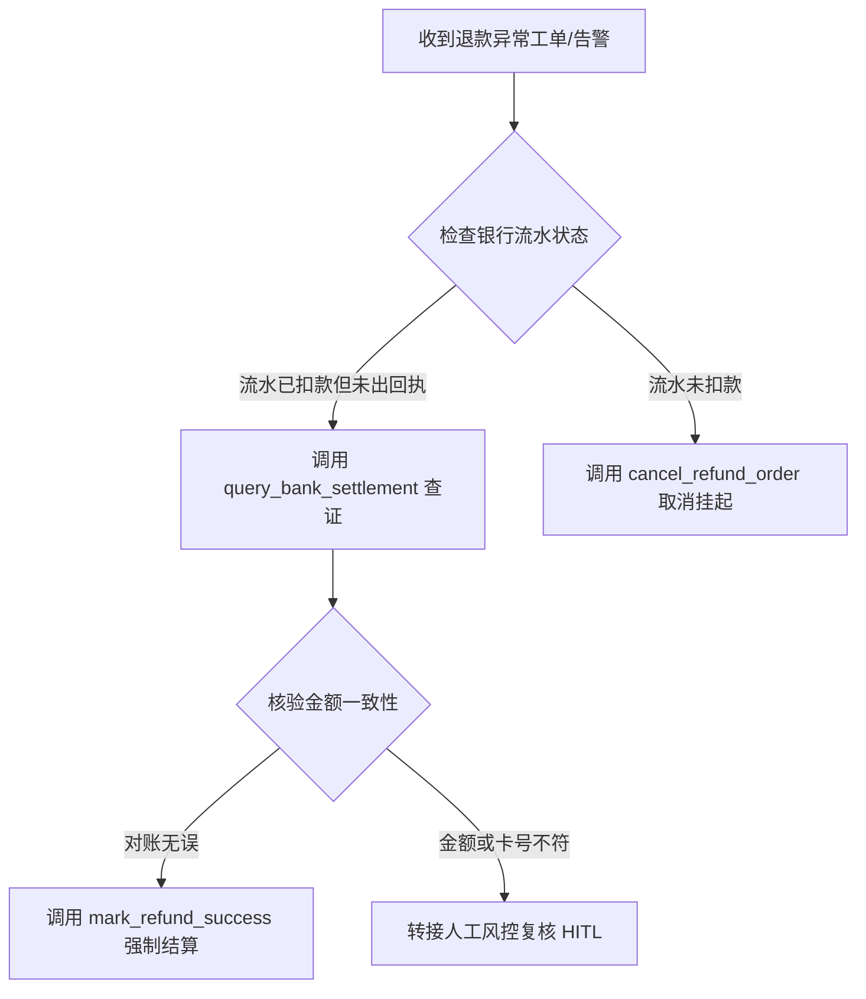

# Reverse SOP Decompiler from Transcript History

## Bash execution contract

When calling `bash_code_execute_tool`, always pass **`reason`** (≥10 characters: why this command runs) and **`command`**. Put `reason` first.


## Overview

In enterprise operations, customer support, and IT incident triage, veteran operators execute complex decision-making through tacit knowledge. This knowledge rarely exists in written documentation—it is buried in thousands of hours of audio recordings, support chat tickets, and emergency Slack channels.

The **Reverse SOP Decompiler** acts as a process-mining intelligence layer that digests real-world dialogue transcripts, extracts implicit logic gates, and outputs:
1. **Auditable SOP Specification** (Markdown format).
2. **Visual Mermaid Decision Flowchart** (`graph TD`).
3. **Executable Agent Profile YAML** (Ready to mount onto a Myrmidon digital worker).

---

## 1. The Four-Stage Decompilation Pipeline

```text
Raw Dialogues / Call Transcripts ──> Noise Stripping & Intent Tagging
                                          │
                                          ▼
Causal Logic Mining ─────────────────────> 1. Trigger Conditions & Preconditions
                                          2. Branching Decision Gates (If/Else)
                                          3. Action Space (APIs, Tools, Queries)
                                          4. HITL Escalation Fallbacks
                                          │
                                          ▼
Dual Output Synthesis ───────────────────> 1. `docs/sop/{process_slug}.md` + Mermaid
                                          2. `agents/{process_slug}.yaml` Profile
```

---

## 2. Standard SOP Output Schema (`docs/sop/{process_slug}.md`)

Every decompiled SOP must adhere to this formal structure:

### 1. Process Metadata
- **Process ID & Name**: e.g., `SOP-FIN-042: 跨行退款异常与对账差异人工介入排障`
- **Trigger Event**: e.g., `系统收到退款挂起告警 (Webhook refund_pending) 且超过 2 小时未完成`
- **Execution Role**: `资深对账运维专员`

### 2. Mermaid Decision Flowchart


### 3. Step-by-Step Operational Matrix

| Step ID | Step Name | Condition / Precondition | Action & Tools | Expected Output | Fallback Escalation |
| :--- | :--- | :--- | :--- | :--- | :--- |
| `STEP_01` | 渠道状态自检 | 工单创建后立即执行 | `api_check_channel(code)` | 渠道通畅或维护中 | 若维护中直接挂起工单 |
| `STEP_02` | 流水对齐比对 | 渠道状态正常 | `db_query_transactions` | 检索到 1 条账单记录 | 未查到记录转人工排查 |

---

## 3. Deployable Agent Profile Export (`agents/{process_slug}.yaml`)

To turn the decompiled SOP into an autonomous worker:

```yaml
id: sop-operator-{process_slug}
name: "{Process Name} Automation Agent"
description: "Decompiled digital worker implementing SOP-{slug} from transcript history."
system_prompt: >-
  You are an operations specialist strictly executing the procedures defined in SOP-{slug}.
  Always evaluate decision branches in the exact sequence specified by the Mermaid flowchart.
  Escalate to human review immediately if any transaction delta exceeds tolerance.
tools:
  - file_read_tool
  - bash_code_execute_tool
```
