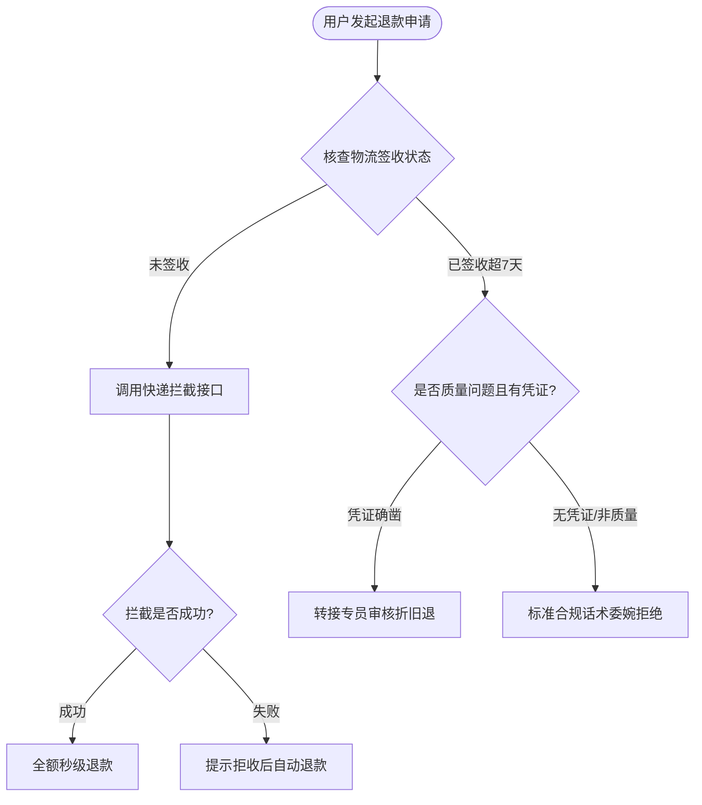

# SOP Reverse Decompiler from Transcript History (历史会话/录音工单逆向 SOP 反编译技能)

## Overview

A specialized enterprise skill for transforming tacit, unwritten human business workflows—captured across sales call recordings, customer support tickets, or operations chat transcripts—into explicit, deterministic **Mermaid Flowcharts, Standard Operating Procedures (SOPs), and Agent Skill Profiles**.

This eliminates the costly, multi-month consulting interview bottleneck when rolling out enterprise digital employees.

---

## 4-Stage Decompilation Pipeline (四阶 SOP 逆向反编译工作流)

```
Stage 1: Transcript Ingestion & PII Redaction (语料摄取与隐私脱敏)
   ├── Ingest raw multi-turn dialogue, call transcripts, or ticket logs
   └── Redact sensitive phone numbers, customer IDs, and trade secrets
Stage 2: Entity & Decision Branch Mining (节点抽取与分支推演)
   ├── Extract Action Nodes (what did the human operator actually do?)
   ├── Extract Decision Gates (what conditions triggered path A vs path B?)
   └── Extract Escalation Triggers (when did the human escalate to tier-2 / supervisor?)
Stage 3: Formal Mermaid State Diagram Synthesis (结构化流程图与 SOP 规约)
   ├── Generate deterministic Mermaid graph (TD or LR) with clear state IDs
   └── Author structured Markdown SOP: Preconditions, Steps, Error Handling, and KPIs
Stage 4: Executable Agent Profile / Skill Packaging (数字化员工技能包生成)
   └── Export ready-to-run Agent Profile YAML or new `SKILL.md` bundle
```

---

## Output Contract & Template (`docs/sop/{process-name}-sop.md`)

```markdown
# 业务标准作业程序 (SOP): [流程名称]

- **反编译数据源**: [工单集/录音转写名称, 例如: 2026-09 售后争议退款录音共 50 份]
- **主导岗位角色**: [例如: 高级售后争议客服]
- **核心业务目标**: [例如: 在保障客诉满意度的前提下，将非必要全额退款率降低 15%]

---

## 一、逆向反编译业务流程图 (Mermaid Workflow)



---

## 二、标准化作业节点定义表 (Atomic Operation Matrix)

| 节点编号 | 节点名称 | 前置触发条件 | 执行动作与调用工具 | 容错与升级分支 |
|---|---|---|---|---|
| N1 | 物流状态核验 | 收到退款工单 | 检索物流中间件追踪轨迹 | 若物流单号失效，发起主动澄清 |
| N2 | 拦截通知 | 处于未签收态 | 发送拦截指令 | 拦截失败流转至 N2-B 拒收引导 |
| N3 | 终态确认 | 拦截成功或已入库 | 执行财务打款网关 | 异常网络超时需幂等重试 |

---

## 三、数字化员工执行规约 (Agent System Prompt Constraint)
- 严格遵循 Mermaid 图中的条件转移路径，禁止跨过 N1 直接进入打款网关。
- 遇到退款金额超过 ¥500 的特殊异常，必须调用 `ask_question_tool` 触发人工复核（HITL）。
```

---

## Anti-Hallucination & Evidence Rules
- **No Inferred Ghost Branches**: Do not invent fantasy business steps that have zero basis in the provided transcripts. If a decision path is ambiguous, mark it with `?` and prompt the user for human review.
- **Traceability**: Every generated node must cite at least one dialogue turn or ticket snippet as ground truth.
